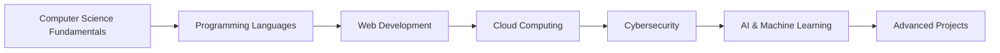

<h1 align="center">
  
</h1>

  

###

Hey there! Welcome to my GitHub profile. I'm <strong>Ambavaram Tirumala Kondareddy</strong> 👋, a passionate coder and a student at <strong>Saveetha School of Engineering</strong> 🎓 pursuing a BE in Computer Science 💻 with a focus on cybersecurity and cloud computing.

###

<h2 align="left">About Me ✨</h2>

###

###

<h5 align="left">🔭 Currently working on network management and bandwidth optimization. 👯 Looking to collaborate on cloud computing projects. 🤝 Need help with advanced Python topics. 🌱 Learning Java and web development. 💬 Ask me about cybersecurity or network topologies. ⚡ Fun fact: I love solving puzzles with AI! ☕💻</h5>

###

## 📚 Learning Journey

###

<h2 align="left">Interest and Skills 🔥</h2>

###

  
  
  
  
  
  
  
  
  
  
  
  

###

## 🛠️ Skills & Technologies

  

  
  
  
  
  
  
  
  
  
  

## 💻 Extended Tech Stack:

### Programming Languages
 
 
 
 
 

### Cloud & Hosting Platforms
 
 
 
 

### Databases
 
 

### Data Science & Machine Learning
 
 

### Version Control & Development Tools
 
 

###

<h2 align="left">Let's Connect! 🌐</h2>

###

  
  
  
  
  
  

###

<h2 align="center">⚡ Stats ⚡</h2>
 

<!-- Updated Stats Section with Better Configuration -->

  

    
    
  

           
  

    
  

  
  <!-- Alternative Stats Provider -->
   
  

    
  

  
   
   
   

###

<h2 align="center">📈 Contribution Activity</h2>

  

  
### 🌊 GitHub Activity Flow

###

  <h2>🚀 My Contributions 🚀</h2>
   

  <picture>
    <source media="(prefers-color-scheme: dark)" srcset="https://raw.githubusercontent.com/Kondareddy1209/Kondareddy1209/output/github-contribution-grid-snake-dark.svg" />
    <source media="(prefers-color-scheme: light)" srcset="https://raw.githubusercontent.com/Kondareddy1209/Kondareddy1209/output/github-contribution-grid-snake.svg" />
    
  </picture>

   
   
   

###

<h2 align="center">🏆 Trophies 🏆</h2>

  

###

## 🎯 Current Focus Areas

- **🔐 Cybersecurity**: Network security, ethical hacking, and security analysis
- **☁️ Cloud Computing**: AWS, Google Cloud Platform, and cloud architecture
- **🌐 Web Development**: Full-stack development with modern frameworks
- **📊 Data Science**: Machine learning and data analysis with Python
- **🤝 Open Source**: Contributing to open-source projects and communities

---

<h4 align="center">
  <a href="https://github.com/Kondareddy1209?tab=repositories" title="Show Repositories">🔎 Show More 🔍</a>
</h4>

---

  <h3>⭐ Don't forget to star my repositories if you find them interesting! ⭐</h3>
  
  
  
    
  
  <i>Happy Coding! 😊</i>
  
   
  
  <i>Made with ❤️ by Kondareddy</i>

---

